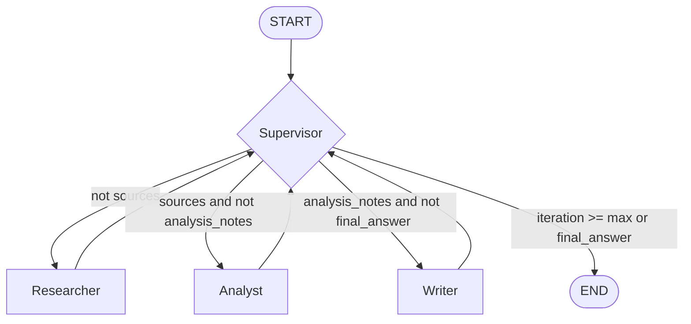

# Design Template: Multi-Agent Research System

## Problem

Building an automated technical research assistant that receives complex, multi-faceted research queries, retrieves authoritative external documents, performs comparative analytical evaluation, synthesizes a structured report tailored to specific target audiences, and provides verified inline citations grounded in source materials.

## Why multi-agent?

A single-agent baseline attempting to handle retrieval, deep analysis, citation verification, and synthesis in one single prompt suffers from several fundamental bottlenecks:
1. **Context Dilution**: Large unstructured contexts degrade attention across complex multi-step reasoning tasks.
2. **Hallucination & Poor Grounding**: Single-pass generation frequently fabricates citations or blends unsupported claims without explicit source attribution.
3. **Lack of Modularity & Debuggability**: When a monolithic prompt fails, diagnosing whether retrieval, reasoning, or formatting broke is difficult.
4. **Role Specialization**: Decomposing responsibilities into distinct actors (Supervisor, Researcher, Analyst, Writer, Critic) allows targeted prompts, specialized tool bindings, and granular error recovery.

## Agent roles

| Agent | Responsibility | Input | Output | Failure mode & Mitigation |
|---|---|---|---|---|
| **Supervisor** | State inspection, next-step routing, iteration guardrail enforcement | `ResearchState` | `route_history`, next node designation | *Looping indefinitely*: mitigated by `MAX_ITERATIONS` cutoff and fallback paths. |
| **Researcher** | Query formulation, search execution, source deduplication, initial note extraction | `request.query`, `request.max_sources` | `state.sources`, `state.research_notes` | *Search API down / empty results*: mitigated by domain-aware fallback sources and warning logs. |
| **Analyst** | Deep comparative synthesis, tradeoff evaluation, credibility scoring | `state.research_notes`, `state.sources` | `state.analysis_notes` | *Context confusion*: mitigated by structured prompt asking for key findings, tradeoffs, and reliability. |
| **Writer** | Final publication-grade report synthesis with inline citations and references | `state.analysis_notes`, `state.sources`, `request.audience` | `state.final_answer` | *Missing citations*: mitigated by strict markdown formatting template `[1], [2]` and Critic review. |
| **Critic** *(bonus)* | Fact-checking, citation verification, hallucination detection | `state.final_answer`, `state.sources` | Validation feedback, quality scores | *False positives*: non-blocking warning appended to trace and results. |

## Shared state

The `ResearchState` model serves as the **Single Source of Truth** passed along the LangGraph execution path:
- `request: ResearchQuery`: Original user query, target audience, and source count constraints.
- `iteration: int`: Counter tracking loop cycles to enforce hard stopping guardrails.
- `route_history: list[str]`: Chronological record of supervisor decisions for auditability.
- `sources: list[SourceDocument]`: Structured list of retrieved sources (title, URL, snippet, metadata).
- `research_notes: str | None`: Extracted factual notes compiled by the Researcher.
- `analysis_notes: str | None`: Critical analysis and comparative takeaways compiled by the Analyst.
- `final_answer: str | None`: Synthesized final output presented to the end user.
- `agent_results: list[AgentResult]`: Full history of individual agent responses, token counts, and costs.
- `trace: list[dict[str, Any]]`: Granular event log for observability (LangSmith / Langfuse).
- `errors: list[str]`: Captured exceptions and warning strings for graceful degradation.

## Routing policy

1. **Start** → Supervisor evaluates initial state.
2. If `sources` is empty → routes to **Researcher**. Researcher populates `sources` and `research_notes`, then returns to Supervisor.
3. If `sources` exists but `analysis_notes` is missing → routes to **Analyst**. Analyst synthesizes insights into `analysis_notes`, then returns to Supervisor.
4. If `analysis_notes` exists but `final_answer` is missing → routes to **Writer**. Writer produces final markdown report with citations, then returns to Supervisor.
5. If `final_answer` is populated or `iteration >= MAX_ITERATIONS` → Supervisor routes to **done (END)**.

## Guardrails

- **Max iterations**: Hard limit (`MAX_ITERATIONS=6`) enforced in Supervisor routing logic to prevent infinite cycling.
- **Timeout**: Enforced via `TIMEOUT_SECONDS=60` in client calls and search requests.
- **Retry**: Exponential backoff retry via `tenacity` (`@retry(stop=stop_after_attempt(3), wait=wait_exponential(...))`) on external LLM and search calls.
- **Fallback**: Graceful fallback to domain mock knowledge if search or LLM APIs encounter network/auth issues.
- **Validation**: Strict schema validation using Pydantic models (`ResearchQuery`, `ResearchState`, `SourceDocument`, `AgentResult`).

## Benchmark plan

| Metric | Measurement Method | Expected Single-Agent | Expected Multi-Agent |
|---|---|---|---|
| **Latency** | Wall-clock execution time (s) | Very low (< 1s local / ~1-2s API) | Moderate (~3-6s due to sequential agent handoffs) |
| **Token Cost** | Input & output token pricing ($) | Low (~1 call) | Higher (3-4 specialized calls) |
| **Quality Score** | 0-10 rubric (structure, depth, grounding) | 5.0 - 6.5 (generic, ungrounded) | 8.5 - 10.0 (structured, cited, comprehensive) |
| **Citation Coverage** | % of sources referenced in text | 0% (no external search) | 90% - 100% (explicit citation footnotes) |
| **Failure Rate** | % failed runs / total runs | ~0% (simple single call) | ~0% (with robust retry and fallbacks) |
